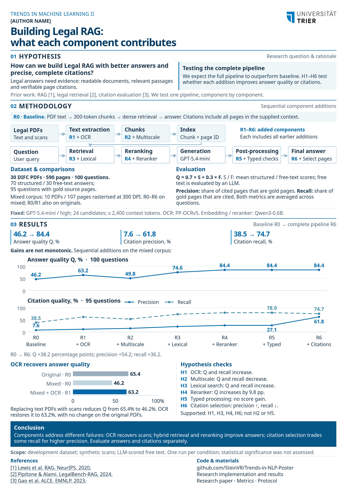

# Building Legal RAG: What Each Component Contributes

This repository contains an empirical study of a legal Retrieval-Augmented Generation (RAG) system. The system must read heterogeneous legal PDFs, retrieve evidence for a question, produce a type-correct answer, and cite the pages that support it. The study evaluates answer quality and citation quality separately because a better answer does not necessarily imply better citations.



## Research question

How can a legal RAG pipeline improve answer quality while keeping source-page citations both precise and complete?

The experiment starts with a simple dense-retrieval baseline and adds six components in sequence:

1. OCR for scanned pages.
2. Page, section, clause, microchunk, and table representations.
3. Hybrid dense and lexical retrieval.
4. Neural reranking.
5. Type-specific answer processing.
6. Post-answer citation selection.

The main comparison uses 30 DIFC legal PDFs containing 590 pages and 100 questions. Seventy questions have structured answers and 30 have free-text answers. Gold source pages are available for 95 questions. To test OCR under controlled conditions, 10 documents containing 107 pages were rasterised at 300 DPI without a text layer. The same questions, gold answers, document identifiers, and page numbers are used across conditions.

## Architecture

```text
    +----------------------+       +----------------------+
    | Legal PDFs           |------>| Page parsing + OCR   |
    | native + scanned     |       | structure + tables   |
    +----------+-----------+       +----------+-----------+
               |                              |
               |                              v
               |                   +----------------------+
               |                   | Page-stable corpus   |
               |                   | text + provenance    |
               |                   +----------+-----------+
               |                              |
               v                              v
    +----------------------+       +----------------------+
    | Typed questions      |------>| Multi-scale index    |
    | metadata + schema    |       | dense + BM25         |
    +----------+-----------+       +----------+-----------+
               |                              |
               v                              v
    +----------------------+       +----------------------+
    | Hybrid retrieval     |<------| Qwen embeddings      |
    | fusion + reranking   |       | Qwen reranker        |
    +----------+-----------+       +----------------------+
               |
               v
    +----------------------+       +----------------------+
    | Typed answering      |------>| Citation selection   |
    | validation + LLM     |       | page validation      |
    +----------+-----------+       +----------+-----------+
               |                              |
               +--------------+---------------+
                              v
                   +----------------------+
                   | Answers + pages      |
                   | metrics + traces     |
                   +----------------------+
```

### Ingestion

The ingestion layer preserves page identity from the beginning because every final citation must resolve to a document and page. It first attempts native PDF extraction, identifies pages with missing or suspicious text, and routes those pages through PP-OCRv5. The parser retains headings, clauses, list items, tables, text blocks, and extraction provenance.

### Indexing and retrieval

The index keeps multiple views of the page-stable corpus. Page chunks preserve citation boundaries, section and clause chunks retain legal context, microchunks help exact matching, and table chunks expose row-level facts. Qwen3-Embedding-0.6B produces dense vectors, while BM25 provides lexical scores. Reciprocal-rank fusion combines both candidate sets before Qwen3-Reranker-0.6B reranks the evidence.

### Answering and citations

The answering layer uses a fixed GPT-5.4-mini configuration and a typed JSON schema. Boolean, number, name, name-list, date, and free-text answers share the same retrieved context but use type-aware normalization and validation. Citation selection runs after answering: it uses the model's supporting-chunk references to narrow the final page set without changing the answer itself.

### Evaluation

Answer quality is reported as `Q = 0.7 × structured score + 0.3 × free-text score`. Citation precision is the share of emitted pages that are gold pages; citation recall is the share of gold pages that were emitted. Citation metrics are macro-averaged over the 95 questions with page annotations.

## Results

| Variant | Component added | Q | Citation precision | Citation recall |
| --- | --- | ---: | ---: | ---: |
| R0 | Dense baseline | 46.2% | 7.6% | 38.5% |
| R1 | OCR | 63.2% | 11.2% | 61.6% |
| R2 | Multi-scale chunks | 49.8% | 14.7% | 52.9% |
| R3 | Lexical retrieval | 74.6% | 22.2% | 72.7% |
| R4 | Reranking | 84.4% | 27.1% | 78.9% |
| R5 | Type-specific processing | 84.4% | 27.1% | 78.9% |
| R6 | Citation selection | 84.4% | 61.8% | 74.7% |

The complete pipeline improves answer quality by 38.2 percentage points over the baseline. OCR restores most of the quality lost when text PDFs are replaced by scans. Hybrid retrieval and reranking produce the largest answer-quality gains. Multi-scale chunking alone does not improve this dataset, and the additional typed post-processing does not change the measured answer score. Citation selection more than doubles precision relative to R5, but recall falls by 4.2 percentage points. This exposes the central operational trade-off: a smaller citation set is easier to verify, but may omit part of the required support.

These are single-run results on a development dataset with synthetic scans and LLM-scored free-text answers. The experiment does not estimate run-to-run variance or statistical significance.

## Repository contents

- [`research/legal-rag/`](research/legal-rag/) contains the pipeline code, experiment runner, fixed protocol, and evaluation logic.
- [`output/poster-narrative-3/research-paper.md`](output/poster-narrative-3/research-paper.md) contains the full research narrative and limitations.
- [`output/poster-narrative-3/results/`](output/poster-narrative-3/results/) contains aggregate metrics, per-question scores, retrieval diagnostics, and verification reports.
- [`output/poster-narrative-3/poster/`](output/poster-narrative-3/poster/) contains the editable HTML poster, print PDF, and PNG preview.
- [`output/poster-narrative-3/powerpoint/`](output/poster-narrative-3/powerpoint/) contains an editable A1 PowerPoint version.

## Reproducing the experiment

Use Python 3.12 from `research/legal-rag/`. The experiment uses separate runtime and OCR environments; exact package versions are recorded in `experiments/requirements-runtime.lock.txt` and `experiments/requirements-ocr.lock.txt`.

```bash
cd research/legal-rag
.venv/bin/python -m experiments.prepare
.venv/bin/python -m experiments.extract --corpus original
.venv/bin/python -m experiments.extract --corpus original --ocr
.venv/bin/python -m experiments.extract --corpus mixed
OMP_NUM_THREADS=1 OPENBLAS_NUM_THREADS=1 \
  .venv-ocr/bin/python -m experiments.extract --corpus mixed --ocr
.venv/bin/python -m pytest experiments/test_protocol.py -q
.venv/bin/python -m experiments.retrieval index
.venv/bin/python -m experiments.retrieval retrieve
.venv/bin/python -m experiments.verify
.venv/bin/python -m experiments.answer --env-file .env --workers 3
.venv/bin/python -m experiments.score --env-file .env --workers 3
.venv/bin/python -m experiments.report
```

Model calls require `OPENAI_API_KEY`, `CODEX_API_KEY`, or `CODEX_OAUTH_TOKEN`. Credentials are read from the environment and are not written to experiment outputs.
